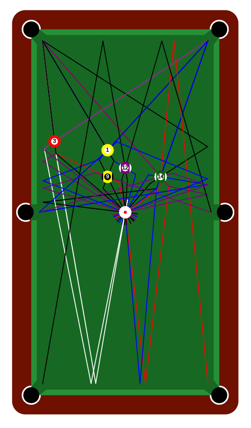

# PyPool-PathFinder  
Finds possible paths for a taking a shot in a pool setup. Made using [P5js](https://p5js.org/) and Python Flask.  
Currently it returns all the possible shots, but the final goal is to only give the top N shots we can take.  

  

## Download and Run  
```bash
git clone https://github.com/saiakarsh193/PyPool-PathFinder.git
cd PyPool-PathFinder
py app.py
```  
Then go to your browser and open `http://localhost:2501/`.  

## Notes  
- Currently, the input which includes the metadata and the ball positions is hardcoded in the `static/sketch.js` file.  
- Currently, the PathFinder only supports direct collisions (which can be set to have n-level path), and single wall bounce shots.  